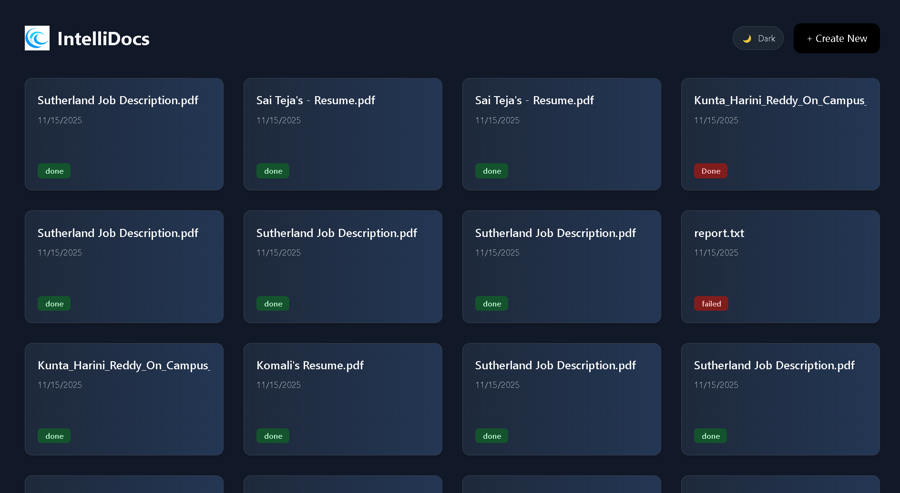
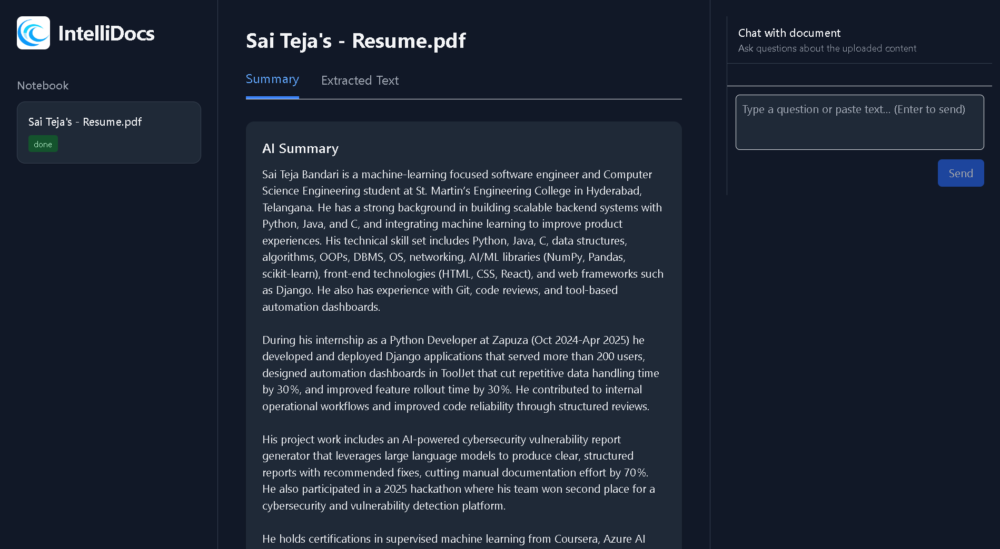

# 🌌 IntelliDocs — AI Document Intelligence Platform

IntelliDocs is an **AI-powered document intelligence and smart notebook system**. 
It allows users to upload documents, paste text, or provide URLs — and transforms them into **interactive AI notebooks** powered by OCR + LLM summarization.

With a **dark UI**, intelligent search, and chat-based exploration, IntelliDocs is built for students, analysts, developers, and anyone who wants to understand documents quickly and deeply.

---

## 🚀 Demo Preview


Interface of the IntelliDocs.


The uploaded Files can be visible here and we can upload new files here. 


An interactive page the summarizes the documents and also provides with a chatbot that can help the users to easily find the necessary information in the documents.

---

## ✨ Features

### 🔍 **Document Intelligence**
- PDF, text, and image upload  
- Extracted text using **Tesseract OCR**  
- Auto-summary using **Groq **  
- Key insights and structured metadata  
- URL→Content processing  
- Paste text → AI notebook creation  

### 🧠 **AI Notebook System**
- Notebook-style document viewer  
- Summary, extracted text, and insights  
- Chat with your document  
- Context-aware LLM answers  
- Notebook history & listing  

### 🌌 **UI/UX**
- Dark futuristic landing page   
- Smooth animations & transitions  
- Responsive layout  

### ⚙️ **Tech Stack**
#### **Backend**
- Django  
- Django REST Framework  
- Tesseract OCR  
- Poppler PDF renderer  
- Groq API for LLM summarization  

#### **Frontend**
- React 
- TailwindCSS  
- Axios  
- React Router  
- Markdown rendering  

---

## 📁 Project Structure

```

IntelliDocs/
│
├── backend/
│ ├── docs_app/
│ │ ├── models.py
│ │ ├── views.py
│ │ ├── serializers.py
│ │ ├── ocr_utils.py
│ │ └── urls.py
│ ├── backend/
│ ├── media/docs/
│ ├── manage.py
│
├── frontend/
│ ├── src/
│ │ ├── components/
│ │ ├── pages/
│ │ ├── services/
│ │ ├── App.js
│ │ └── main.jsx
│ └── public/
│
└── README.md

```

---

## 🔌 API Endpoints (Backend - Django)

### **Documents**
| Method | Endpoint | Description |
|--------|----------|-------------|
| POST | `/api/documents/` | Upload a new document |
| GET | `/api/documents/` | List all documents |
| GET | `/api/documents/:id/` | Retrieve notebook details |
| POST | `/api/text/` | Upload raw text |
| POST | `/api/url/` | Upload content fetched from a URL |

---

## ⚙️ Installation

### 🖥️ Backend Setup (Django)

```bash
cd backend
python -m venv venv
venv/Scripts/activate
pip install -r requirements.txt


Required External Tools
Install Poppler

https://github.com/oschwartz10612/poppler-windows/releases/

Add Poppler bin/ folder to PATH.

Install Tesseract OCR

https://github.com/UB-Mannheim/tesseract/wiki

Add Tesseract installation path to PATH.